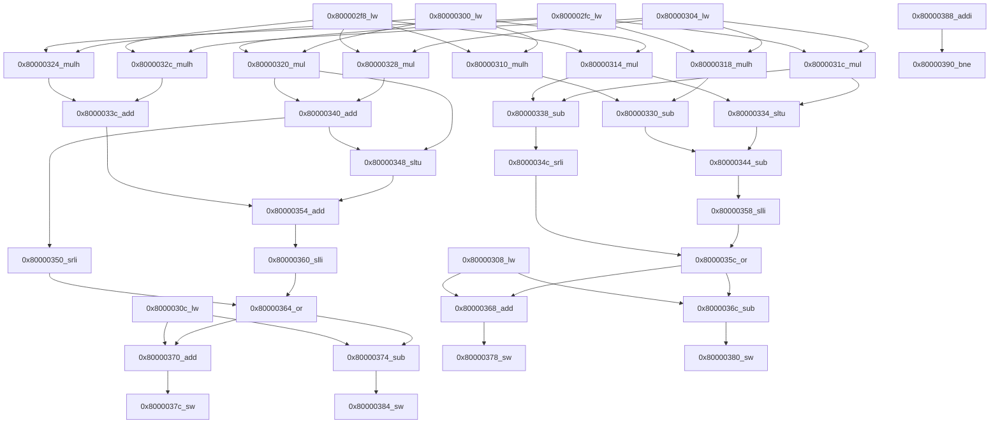

```mermaid
flowchart TD
    0x800002f8_lw --> 0x80000310_mulh
    0x80000300_lw --> 0x80000310_mulh
    0x800002f8_lw --> 0x80000314_mul
    0x80000300_lw --> 0x80000314_mul
    0x800002fc_lw --> 0x80000318_mulh
    0x80000304_lw --> 0x80000318_mulh
    0x800002fc_lw --> 0x8000031c_mul
    0x80000304_lw --> 0x8000031c_mul
    0x800002fc_lw --> 0x80000320_mul
    0x80000300_lw --> 0x80000320_mul
    0x800002fc_lw --> 0x80000324_mulh
    0x80000300_lw --> 0x80000324_mulh
    0x800002f8_lw --> 0x80000328_mul
    0x80000304_lw --> 0x80000328_mul
    0x800002f8_lw --> 0x8000032c_mulh
    0x80000304_lw --> 0x8000032c_mulh
    0x80000310_mulh --> 0x80000330_sub
    0x80000318_mulh --> 0x80000330_sub
    0x80000314_mul --> 0x80000334_sltu
    0x8000031c_mul --> 0x80000334_sltu
    0x80000314_mul --> 0x80000338_sub
    0x8000031c_mul --> 0x80000338_sub
    0x80000324_mulh --> 0x8000033c_add
    0x8000032c_mulh --> 0x8000033c_add
    0x80000320_mul --> 0x80000340_add
    0x80000328_mul --> 0x80000340_add
    0x80000330_sub --> 0x80000344_sub
    0x80000334_sltu --> 0x80000344_sub
    0x80000340_add --> 0x80000348_sltu
    0x80000320_mul --> 0x80000348_sltu
    0x80000338_sub --> 0x8000034c_srli
    0x80000340_add --> 0x80000350_srli
    0x8000033c_add --> 0x80000354_add
    0x80000348_sltu --> 0x80000354_add
    0x80000344_sub --> 0x80000358_slli
    0x8000034c_srli --> 0x8000035c_or
    0x80000358_slli --> 0x8000035c_or
    0x80000354_add --> 0x80000360_slli
    0x80000350_srli --> 0x80000364_or
    0x80000360_slli --> 0x80000364_or
    0x80000308_lw --> 0x80000368_add
    0x8000035c_or --> 0x80000368_add
    0x80000308_lw --> 0x8000036c_sub
    0x8000035c_or --> 0x8000036c_sub
    0x8000030c_lw --> 0x80000370_add
    0x80000364_or --> 0x80000370_add
    0x8000030c_lw --> 0x80000374_sub
    0x80000364_or --> 0x80000374_sub
    0x80000368_add --> 0x80000378_sw
    0x80000370_add --> 0x8000037c_sw
    0x8000036c_sub --> 0x80000380_sw
    0x80000374_sub --> 0x80000384_sw
    0x80000388_addi --> 0x80000390_bne
```
